# Rossoctl Operator

[](LICENSE)


**Rossoctl Operator** is a Kubernetes operator that automates the deployment, discovery, and security of AI agents in Kubernetes clusters. It provides workload identity (SPIFFE), mutual authentication (OAuth2/Keycloak), agent-to-agent trust (A2A signature verification), and observability (MLflow tracing) — all declaratively managed through Custom Resources.

## Overview

The Rossoctl Operator manages the following Custom Resource Definitions (CRDs):

| Resource | Purpose |
|----------|---------|
| **[AgentRuntime](./operator/docs/api-reference.md#agentruntime)** | Enrolls a workload into the Rossoctl platform — applies labels, triggers sidecar injection, and configures identity and observability |
| **[AgentCard](./operator/docs/api-reference.md#agentcard)** | Discovers, indexes, and verifies agent metadata for Kubernetes-native agent discovery |

### Key Features

- **Declarative Agent Enrollment** — Create an `AgentRuntime` CR pointing to a clean Deployment; the operator applies labels, injects sidecars, and manages rolling updates automatically
- **AuthBridge Sidecar Injection** — Mutating webhook injects envoy-proxy (mTLS + token exchange), SPIFFE helper (workload identity), and client registration (Keycloak OAuth2) sidecars
- **Dynamic Agent Discovery** — Automatic indexing of agent metadata via the [A2A protocol](https://a2a-protocol.org/)
- **Signature Verification** — JWS-based cryptographic verification of agent cards (RSA, ECDSA) using SPIRE X.509 trust bundles
- **Identity Binding** — SPIFFE-based workload identity binding with trust domain validation
- **Network Policy Enforcement** — Automatic NetworkPolicy creation based on signature verification status
- **MLflow Integration** — Auto-discovers MLflow instances, creates per-agent experiments, and configures tracing
- **Multi-Framework Support** — Works with LangGraph, CrewAI, AG2, and any A2A-compatible framework

## Architecture

```mermaid
graph TB
    subgraph "User Interaction"
        User[User/Developer]
        User -->|Creates| Deployment[Deployment/StatefulSet]
        User -->|Creates| RuntimeCR[AgentRuntime CR]
    end

    subgraph "Rossoctl Operator"
        ValidationWebhook[Validating Webhooks]
        InjectionWebhook[AuthBridge Mutating Webhook]
        RuntimeController[AgentRuntime Controller]
        SyncController[AgentCard Sync Controller]
        CardController[AgentCard Controller]
        NPController[NetworkPolicy Controller]
        MLflowController[MLflow Controller]

        RuntimeCR -->|Validates| ValidationWebhook
    end

    subgraph "Config Sources"
        ClusterCM[Cluster Defaults ConfigMaps]
        NsCM[Namespace Defaults ConfigMap]
    end

    subgraph "Runtime"
        Pod[Agent Pods]
        Deployment -->|Creates| Pod
        InjectionWebhook -->|Injects sidecars at CREATE| Pod
        CardController -->|Fetches agent card from| Pod
    end

    RuntimeController -->|Applies labels + config-hash| Deployment
    RuntimeController -->|Reads defaults| ClusterCM
    RuntimeController -->|Reads defaults| NsCM
    RuntimeController -->|Watches| RuntimeCR

    SyncController -->|Watches| Deployment
    SyncController -->|Auto-creates| AgentCardCR[AgentCard CR]
    CardController -->|Reconciles| AgentCardCR
    NPController -->|Creates| NetworkPolicy[NetworkPolicy]
    MLflowController -->|Discovers MLflow, injects env vars| Deployment

    style User fill:#ffecb3
    style RuntimeCR fill:#e1f5fe
    style AgentCardCR fill:#e1f5fe
    style ValidationWebhook fill:#fff3e0
    style InjectionWebhook fill:#fff3e0
    style RuntimeController fill:#ffe0b2
    style SyncController fill:#ffe0b2
    style CardController fill:#ffe0b2
    style NPController fill:#ffe0b2
    style MLflowController fill:#ffe0b2
    style Deployment fill:#d1c4e9
    style Pod fill:#c8e6c9
```



The operator runs the following controllers and webhooks:

| Component | Purpose |
|-----------|---------|
| **AgentRuntime Controller** | Reconciles AgentRuntime CRs — applies labels, computes config hash, triggers rolling updates on config change |
| **AuthBridge Webhook** | Mutating webhook that injects sidecar containers (envoy-proxy, SPIFFE helper, client registration) into agent/tool Pods |
| **AgentCard Sync Controller** | Watches labeled Deployments/StatefulSets and auto-creates AgentCard resources |
| **AgentCard Controller** | Fetches agent card data from running agents, verifies JWS signatures, evaluates identity binding |
| **NetworkPolicy Controller** | Creates permissive or restrictive NetworkPolicies based on signature verification status |
| **MLflow Controller** | Auto-discovers MLflow instances, creates experiments per agent, injects tracking env vars and RBAC |

## Bundle Service

Rossoctl includes a dedicated bundle service used by AuthBridge clients to fetch authorization bundles.

The service ships inside the operator image and is **opt-in**. Enable it at install time:

```sh
helm install rossoctl-operator ... --set bundleService.enabled=true
```

Key facts:

- Deployment name: `bundle-service`
- Namespace: the release namespace
- Service type: `ClusterIP`
- Port: `8080`
- Health endpoints: `/healthz`, `/readyz`

Enabling it also installs a NetworkPolicy restricting callers to pods labelled
`rossoctl.dev/authbridge: "true"`. This is the service's **only** access control — it
performs no in-process authorization and serves any bundle named in the `?spiffe=` query
param — so it is installed with the component rather than behind `networkPolicy.enable`.
Note that it only takes effect on a cluster whose CNI enforces NetworkPolicy; kind's
default CNI does not.

Use `operator/cmd/bundle-service/README.md` for SRE runbook guidance and operational details.

## Token Broker

The Token Broker enables HITL (Human-in-the-Loop) authorization: when an agent needs
permissions beyond those in its own token, the broker runs an OAuth 2.0 PKCE flow to
obtain just-in-time, user-scoped credentials.

It also ships inside the operator image and is **opt-in**:

```sh
helm install rossoctl-operator ... \
  --set tokenBroker.enabled=true
```

Key facts:

- Deployment name: `token-broker`
- Namespace: the release namespace
- Service type: `ClusterIP`
- Port: `8190`
- Health endpoints: `/healthz`, `/readyz`
- Replicas: fixed at 1 — sessions and the token cache are in-memory, so scaling out
  requires shared state first

OAuth client credentials are **not** templated by the chart. Create the Secret out of
band and point `tokenBroker.oauth.existingSecret` at it:

```sh
kubectl create secret generic github-oauth-credentials -n rossoctl-system \
  --from-literal=client-id=<CLIENT_ID> --from-literal=client-secret=<CLIENT_SECRET>
```

The chart also installs an HTTPRoute for the OAuth callback. Its hostname defaults to
`token-broker.localtest.me`, which works out of the box on a kind/dev cluster; the host
in `tokenBroker.oauth.callbackUrl` **must** match it, or the provider's post-consent
redirect 404s and the broker waits for a callback that never arrives. Override both for
real deployments, or set `tokenBroker.httpRoute.enabled=false` and route the callback
yourself.

For production, set `tokenBroker.jwt.*` — incoming JWTs are not verified when those are
left unset.

See `operator/cmd/token-broker/README.md` for the API reference and operational details.

## Quick Start

### Prerequisites

- Kubernetes cluster (v1.28+) or OpenShift (v4.19+)
- kubectl configured to access your cluster

### Install the Operator

**Option A — OpenShift (recommended for OCP)**

Use [`scripts/ocp/setup-rossoctl.sh`](https://github.com/rossoctl/rossoctl/blob/main/scripts/ocp/setup-rossoctl.sh) from the [rossoctl](https://github.com/rossoctl/rossoctl) repo. It handles RBAC, SCCs, and Helm installation in one step.

By default the script installs the released operator version pinned as a chart dependency in the `rossoctl` repo's `charts/rossoctl/Chart.yaml`. For development with a local build of this operator, two flags let you override that:

```bash
# Use a local chart and/or a custom operator image instead of the released version
./scripts/ocp/setup-rossoctl.sh \
  --operator-repo /path/to/operator \
  --operator-image quay.io/<your-org>/operator:dev
```

`--operator-repo` accepts a local clone of this repository and substitutes its `charts/operator` chart in place of the pinned dependency. `--operator-image` overrides the container image the chart pulls.

**Option B — Plain Kubernetes (Helm)**

```bash
# Install the operator using OCI chart
helm install rossoctl-operator \
  oci://ghcr.io/rossoctl/operator/operator-chart \
  --namespace rossoctl-system \
  --create-namespace
```

### Deploy Your First Agent

There are two ways to deploy agents. The **AgentRuntime** approach is recommended — it keeps your workload manifests clean and provides identity, auth, and observability configuration.

#### Option 1: AgentRuntime (Recommended)

Deploy a clean Deployment and create an AgentRuntime CR:

```bash
# Deploy the agent workload
kubectl apply -f - <<EOF
apiVersion: apps/v1
kind: Deployment
metadata:
  name: weather-agent
  namespace: default
  labels:
    app.kubernetes.io/name: weather-agent
    protocol.rossoctl.io/a2a: ""
spec:
  replicas: 1
  selector:
    matchLabels:
      app.kubernetes.io/name: weather-agent
  template:
    metadata:
      labels:
        app.kubernetes.io/name: weather-agent
    spec:
      containers:
      - name: agent
        image: "ghcr.io/rossoctl/examples/weather_service:v0.0.1-alpha.3"
        ports:
        - containerPort: 8000
        env:
        - name: PORT
          value: "8000"
---
apiVersion: v1
kind: Service
metadata:
  name: weather-agent
  namespace: default
spec:
  selector:
    app.kubernetes.io/name: weather-agent
  ports:
  - name: http
    port: 8000
    targetPort: 8000
EOF

# Enroll it with an AgentRuntime CR
kubectl apply -f - <<EOF
apiVersion: agent.rossoctl.dev/v1alpha1
kind: AgentRuntime
metadata:
  name: weather-agent-runtime
  namespace: default
spec:
  type: agent
  targetRef:
    apiVersion: apps/v1
    kind: Deployment
    name: weather-agent
EOF
```

The operator will apply `rossoctl.io/type: agent` labels and inject AuthBridge sidecars. The `protocol.rossoctl.io/a2a` label on the Deployment triggers automatic AgentCard creation for agent discovery.

#### Option 2: Manual Labels

For quick tests, add labels directly to your Deployment:

```bash
kubectl apply -f - <<EOF
apiVersion: apps/v1
kind: Deployment
metadata:
  name: weather-agent
  namespace: default
  labels:
    app.kubernetes.io/name: weather-agent
    rossoctl.io/type: agent
    protocol.rossoctl.io/a2a: ""
spec:
  replicas: 1
  selector:
    matchLabels:
      app.kubernetes.io/name: weather-agent
  template:
    metadata:
      labels:
        app.kubernetes.io/name: weather-agent
        rossoctl.io/type: agent
    spec:
      containers:
      - name: agent
        image: "ghcr.io/rossoctl/examples/weather_service:v0.0.1-alpha.3"
        ports:
        - containerPort: 8000
        env:
        - name: PORT
          value: "8000"
EOF
```

### Verify Deployment

```bash
# Check AgentRuntime status (if using AgentRuntime)
kubectl get agentruntime
# NAME                      TYPE    TARGET          PHASE    AGE
# weather-agent-runtime     agent   weather-agent   Active   2m

# Check discovered agent cards
kubectl get agentcards
# NAME                              PROTOCOL   KIND         TARGET          AGENT              SYNCED   AGE
# weather-agent-deployment-card     a2a        Deployment   weather-agent   Weather Assistant   True     5m

# View agent logs
kubectl logs -l app.kubernetes.io/name=weather-agent
```

## Documentation

| Topic | Link |
|-------|------|
| **Getting Started** | [Tutorials & End-to-End Walkthrough](./operator/GETTING_STARTED.md) |
| **API Reference** | [CRD Specifications & Examples](./operator/docs/api-reference.md) |
| **Architecture** | [Operator Design & Components](./operator/docs/architecture.md) |
| **AuthBridge Webhook** | [Sidecar Injection & Configuration](./operator/docs/authbridge-webhook.md) |
| **Controller-Webhook Interaction** | [AgentRuntime Controller & Webhook Coordination](./operator/docs/controller-webhook-interaction.md) |
| **Dynamic Discovery** | [Agent Discovery with AgentCard](./operator/docs/dynamic-agent-discovery.md) |
| **Signature Verification** | [A2A AgentCard Signature Verification](./operator/docs/agentcard-signature-verification.md) |
| **Identity Binding** | [SPIFFE Workload Identity Binding](./operator/docs/agentcard-identity-binding.md) |
| **MLflow Integration** | [MLflow Tracing & Experiment Tracking](./operator/docs/mlflow-integration.md) |
| **Client Registration** | [Operator-Managed Keycloak Registration](./operator/docs/operator-managed-client-registration.md) |
| **Developer Guide** | [Contributing & Development](./operator/docs/dev.md) |

## Examples

See the [config/samples](./operator/config/samples) directory for AgentRuntime examples:

- [`agent_v1alpha1_agentruntime_basic.yaml`](./operator/config/samples/agent_v1alpha1_agentruntime_basic.yaml) — Minimal AgentRuntime with type + targetRef
- [`agent_v1alpha1_agentruntime_full.yaml`](./operator/config/samples/agent_v1alpha1_agentruntime_full.yaml) — With SPIFFE trust domain override and OCI skill images
- [`agent_v1alpha1_agentruntime_tool.yaml`](./operator/config/samples/agent_v1alpha1_agentruntime_tool.yaml) — Tool-type workload (MCP server)

## Contributing

We welcome contributions! See [CONTRIBUTING.md](CONTRIBUTING.md) for guidelines on:

- Reporting issues
- Submitting pull requests
- Development setup
- Testing requirements

## License

[Apache 2.0](LICENSE)
